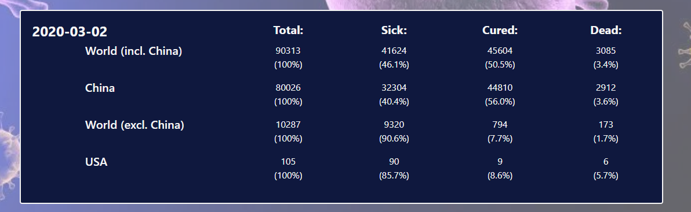

# Project-2 Corona Spread!
By Vamsi Krishna Navuluri, Jim Comas, Meliha Osmanovic and Aukje Rijpkema 3/4/2020

The challenge in Project 2 was to create a full stack application with a assigned group of 4.
The application we created uses:
* A postgreSQL database
* Python back-end for the ETL process - a script will merge the ETL data and geojson files for the world and china, create a 'new' geojson for each day, containing the corona data to allow for color-selection and pop-up information later in the javascript part of the application)
* FLASK API to render data from the database to the front-end application
* HTML/JS/CSS using leaflet.js, plotly.js and slider_world.js/slider_china.js libraries

The end results is the following:

A 3 page interactive webpage, which we deployed on Heroku. Please click  to go to https://corona-spread.herokuapp.com

The app lands on the the "World" page where it will plot the latest spread of Corona Virus world wide. When clicking the Show Spread button, the app will run through the maps by day.

 

Scrolling down a bit, a summary section will display the latest aggregated number for the World, China, the World without China and the USA.

Lastly, a chart with the option to choose an affected country from the drop down box, as well as a 'Top 10 Countries' that are being his the most are displayed.

 

The slider section allows the user to easily 'jump' to a specific day. Map and pop-up data is adjusted on the fly.

The China page is where the project initiated, before the virus went all over the world. It has similar, but less functionality than the worldwide page.

The news page defaults to the last available date and nicely interacts with the slider as well. It provides the user the option to select a date and a news source from a dropdown list interactively.

 

The news facts on the news page that correspond with the selected slider date were created by Meliha Osmanovic.
The news page that interacts with the slider and allows for interactive selections of date and news source were created by Jim Comas.
The slider itself was created by Vamsi Krishna Navuluri.
The backend, interactive maps & charts as well as the Heroku app were created by Aukje Rijpkema.

Most importantly, it was a great TEAM effort!!